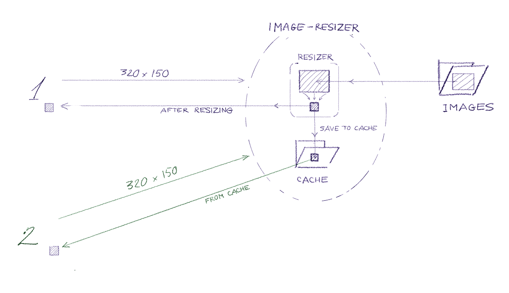

# image-resizer

**Сервис масштабирования изображений.**

Иногда на страницах HTML нужна уменьшенная версия изображения. Передавать файл целиком слишком ресурсоемко. 

##  image-resizer

решает проблему, изменяя изображение на сервере. Пусть исходное изображение 

- /some/path/image.jpg

    
Для получения **масштабированного** изображения с шириной 320 и высотой 150 пикселей, нужно выполнить запрос

- /`resize320x240`/some/path/image.jpg

Для получения **обрезанного** изображения с размерами 320 на 150 пикселей

- /`crop320x240`/some/path/image.jpg

Чтобы не перегружать процессор обработкой изображений, преобразованные копии сохраняются в кэше сервера. При повторных запросах сервер вернет изображение из кэша. 

## Использование с file-uploader

`image-resizer` можно использовать с сервисом загрузки файлов `file-uploader`. В таком случае папку, куда `file-uploader` загружает файлы следует сделать папкой, откуда `image-resizer` берет изображения.

## Изменения размеров

**Масштабирование**  `resize320x150`.  
Изображение масштабируется так, что целиком вписывается в заданный размер.

**Обрезка** `crop320x150`.  
Заданный прямоугольник вырезает максимальную область масштабированного изображения.

Для пропорционального изменения размеров вместо одного из чисел вставьте минус "-", .

## Настройки

- Папка (или url) с исходными изображениями.  Файл `docker-compose.yml`: 

        volumes:
        #  Место для хранения изображений
        - ./directory_for_images:/images

- Папка кэша.  Файл `docker-compose.yml`: 

        volumes:
            ...
            - ./cache_directory/:/cache/
            ...

    Папку кэша можно закомментировать в `docker-compose.yml`. Но в этом случае кэш будет исчезать при перезапуске контейнеров.

- Время жизни уменьшенных изображений в кэше. Файл `configs/image-resizer-default.conf`: 

        proxy_cache_valid  200      24h;

- Размер кэша. Если место для хранения уменьшенных изображений заканчивается, приложение удаляет самые старые файлы освобождая место для новых. Файл `configs/image-resizer-default.conf`: 

        proxy_cache_path /cache 
                ...
                max_size=5G 
                ...

## Проверки

Если под следующими ссылками видны изображения значит сервис доступен.

- Исходное изображение <http://image-resizer.rg.ru/2019/10/03/30830/dont.jpg>

- Масштабированное 320x200  <http://image-resizer.rg.ru/resize320x200/2019/10/03/30830/dont.jpg>

- Обрезанное 320x200 <http://image-resizer.rg.ru/crop320x200/2019/10/03/30830/dont.jpg>

<!-- ## Нагрузочное тестирование -->

------------------------------- 

#  Для разработчиков

Приложение представляет собой контейнеризованную версию **[nginx](https://www.nginx.com/)** с настроечными файлами в разделяемой директории `/configs`.

- Запуск `sh/up.sh`
- Останов `sh/down`
- Рестарт `sh/restart.sh`  

Порядок работы

- Внести изменения
- `sh/push.sh`
- `sh/deploy.sh`

